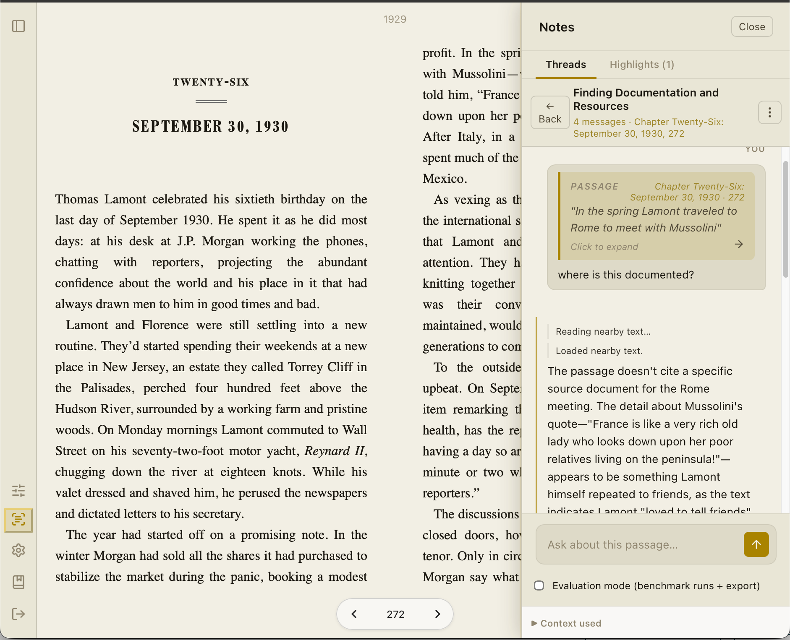
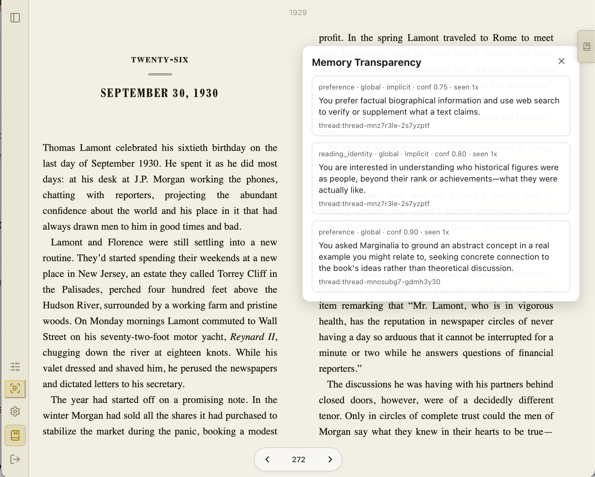

# Marginalia

Marginalia is a local-first EPUB reader with an AI partner built into the act of reading.  
It is designed for close reading, not speed-reading: the model starts with the selected passage, then fetches more context only when needed.

Built with Tauri v2 (`Rust + React + TypeScript`) and Anthropic's Claude API under a bring-your-own-key setup.

## Product At A Glance

- **Reading-first:** the book is the primary interface, and AI is there when invited.
- **Local-first architecture:** EPUB parsing, indexing, thread history, and memory storage happen on your machine.
- **Grounded retrieval:** the model does not receive the full book by default; it asks for extra context via explicit tool calls.
- **Auditable behavior:** tool use and context manifests are logged so retrieval decisions can be inspected.
- **No server backend:** this desktop app runs locally and calls Anthropic directly.

## Screenshots

### Library

### Threads Panel

### Memory Panel

## Architecture Overview

Think of Marginalia as four pieces working together:

1. **Reader (EPUB UI):** renders the book and captures selections/highlights.  
   Implementation anchors: `src/app/reader/components/FoliateViewer.tsx` (L386-L415).
2. **Conversation Threads:** each reading discussion is saved as a thread tied to a passage or book context.  
   Implementation anchors: `src-tauri/src/lib.rs` thread schema in `threads`, `thread_highlights`, `thread_messages` (L480-L509).
3. **Retrieval Layer (Smart Scan + tools):** gives the model a way to fetch only the extra context it needs.  
   Implementation anchors: `src/services/claude.ts` tool definitions `get_context`, `get_section_summary`, `get_section_text` (L728-L788), and Smart Scan storage `section_summaries` in `src-tauri/src/lib.rs` (L511-L530).
4. **Memory Layer:** stores durable reader facts and patterns across sessions.  
   Implementation anchors: `src-tauri/src/lib.rs` tables `memory_items`, `memory_anchors`, `memory_vecs` (L532-L566).

In practice: you highlight a passage, ask a question, and Claude answers from that passage first.  
If needed, it can call tools to fetch nearby text, section summaries, or section text.

## What "Threads" Mean

Think of threads as chat: persistent reading conversations linked to your book context.

- A thread starts from a selected passage or a book-level question.
- Messages are stored locally in SQLite, including assistant responses and retrieval events.
- Follow-ups can inherit the active passage context so the conversation remains coherent.
- Threads can be used in evaluation mode to compare retrieval behavior across conditions.

## Tooling Available To The Model

Marginalia's retrieval tools are intentionally explicit:

- `get_context`  
  Fetch text near the current passage anchor (`before`, `after`, `around`, `from_section_start`).
- `get_section_summary`  
  Fetch Smart Scan summary for a section (`spine_href`).
- `get_section_text`  
  Fetch raw text for a section when line-level evidence is needed.
- `request_web_search` / `web_search`  
  Optional web lookup path for external context (author background, historical references, criticism), not for replacing book-grounded reading.

This is the core "blind model" posture: retrieval is a visible signal of complexity, not an invisible hidden context dump.

## System Prompt And Intended Behavior

At a high level, the system prompt steers the assistant to:

- be concise, grounded, and conversational;
- privilege the selected passage as the first evidence source;
- avoid unnecessary retrieval;
- avoid broad spoilers or fetching ahead without reason;
- use web search only for genuinely external context.

Desired Marginalia behavior:

- **Close read first** -> answer from the text in front of the reader.
- **Retrieve second** -> use tools only when the question needs broader context.
- **Stay spoiler-aware** -> preserve the reader's progression through the book.
- **Show your work** -> retrieval calls are inspectable in logs/manifests.

## Smart Scan And Memory (How They Fit)

### Smart Scan

When enabled, Smart Scan creates per-section summaries and book-level structure hints, then stores them locally in SQLite.  
This gives the model a "map" of the book before it pulls larger text spans.

### Memory Architecture

Memory is a structured, local subsystem for cross-session continuity:

- memory items are stored as atomic facts (with type, scope, confidence, usage metadata);
- anchors connect memories to books/passages/threads;
- embeddings support semantic retrieval over memory items;
- prompt injection is filtered and ranked so only relevant memory enters a turn.

Memory exists in production app behavior but is intentionally scoped out of the main benchmark due to annotation/evaluation cost.

## Evaluation Strategy (Current Run)

Due to budget/time constraints, the active benchmark is run on **3 public-domain books**.

We compare 3 conditions:

1. **Passage-only** (no retrieval tools)
2. **Tool-enabled** (`get_context`)
3. **Smart Scan + tools** (`get_context` + section tools)

Primary evaluation questions:

- Does the model call tools **when needed** (precision/recall of retrieval)?
- Do Smart Scan summaries improve section targeting and answer grounding?
- Does performance improve on broader-context questions vs passage-only?
- Does spoiler-sensitive behavior hold (low spoiler violations)?

## Platform + Model Constraints

Current practical constraints:

- **macOS-only** for development/testing at this stage.
- **Claude-only** model stack (Haiku + Sonnet routing).  
  Adding multi-provider support is possible, but not trivial in this architecture and timeline.

## Running The App (Dev)

Deployment packaging/docs will follow soon. For now, run in local dev mode.

### Prerequisites

- Node.js + npm
- Rust toolchain
- Tauri v2 prerequisites for macOS
- Anthropic API key

### Setup

1. Install dependencies:
   - `npm install`
2. Add your key to `.env`:
   - `VITE_ANTHROPIC_API_KEY=your_key_here`
3. Start app:
   - `npm run tauri dev`

## Local App Data Location (macOS)

Marginalia stores local state under Tauri app data directories.  
In this repo's current config, expect data under:

- `~/Library/Application Support/app.marginalia.reader/marginalia/`

SQLite database:

- `~/Library/Application Support/app.marginalia.reader/marginalia/marginalia.db`

## Repository Notes

- `src/` -> React/TypeScript UI and orchestration
- `src-tauri/` -> Rust commands, DB schema, tool proxying, local persistence
- `eval/` -> evaluation scripts, configs, and output artifacts
- `pngs/` -> README and product screenshot assets

